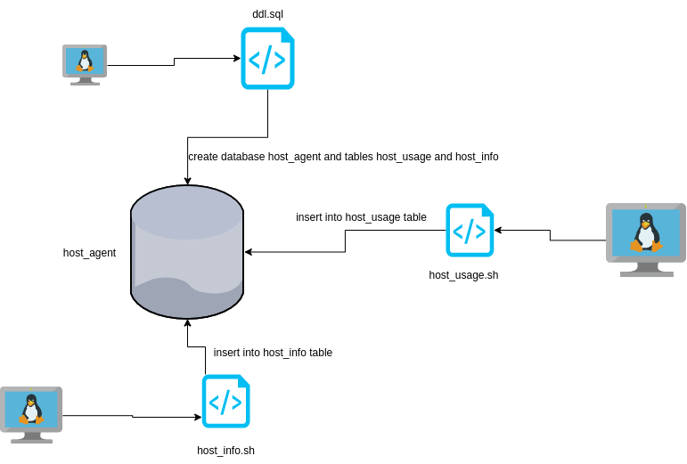

# Linux Cluster Monitoring Agent

# Introduction
The Linux Cluster Monitoring Agent as the name indicates monitors the usage of the hardware by the user. The program runs in a Docker container where a psql instance has been created.
A SQL script has been created to automate the connection to the database and the creation of the tables if they have not been created yet.
Two bash scripts have been created to automate the insertion of entries in the two tables.

# Quick Start
- Start a psql instance using psql_docker.sh
- Create tables using ddl.sql
- Insert hardware specs data into the DB using host_info.sh
- Insert hardware usage data into the DB using host_usage.sh
- Crontab setup

# Implementation
Discuss how you implement the project.
## Architecture

## Scripts
- psql_docker.sh : create/start/stop the docker container and provision a psql instance. Usage : `./scripts/psql_docker.sh`
- host_info.sh : retrieves the information of the hardware and insert it a postgres table inside the `host_agent` database. Usage : `./scripts/host_info.sh`
- host_usage.sh : stores the usage information of the user and insert it in a postgres table inside the `host_agent` database. Usage : `./scripts/host_usage`
- crontab : automatically execute the `host_usage.sh` script every minute and stores the result in `/home/centos/dev/jrvs/bootcamp/linux_sql/host_agent/scripts/host_usage.sh localhost 5432 host_agent postgres password > /tmp/host_usage.log`

## Database Modeling
Describe the schema of each table using markdown table syntax (do not put any sql code)
- `host_info` : 
>id : unique identifier in the table
>hostname : the name of the machine       
>cpu_number : this refers to the number or identifier of the CPU. It can be a sequential number assigned to each CPU core or a unique identifier specific to the system architecture.     
>cpu_architecture : this indicates the architecture of the CPU, such as x86, ARM, or PowerPC. It represents the underlying design and instruction set of the CPU
>cpu_model : this represents the model or name of the CPU. It identifies the specific CPU model within a given architecture, such as Intel Core i7 or AMD Ryzen 5.       
>cpu_mhz : this denotes the clock speed of the CPU in megahertz (MHz). It indicates the number of clock cycles the CPU can perform in one second.        
>l2_cache : this refers to the L2 cache of the CPU. The L2 cache is a type of memory that stores frequently accessed data to improve CPU performance. It is located closer to the CPU cores compared to the main memory.        
>timestamp : this represents the timestamp or date/time when the information was collected or recorded. It indicates the moment in time when the CPU and system information was measured.
>total_mem : this indicates the total amount of memory (RAM) available on the system. It represents the combined capacity of all memory modules installed in the system.
- `host_usage`:
>host_id : the identifier of the host in the host_info table                    
>memory_free : this represents the amount of free memory (RAM) available in the system. It indicates the portion of memory that is not currently in use and is available for use by applications and processes.             
>cpu_idle : this indicates the percentage of CPU time that is idle or not being utilized by any running processes. It represents the idle time of the CPU, where it is not actively executing any tasks.                  
>cpu_kernel : this refers to the percentage of CPU time spent in kernel mode. Kernel mode is a privileged mode of the CPU where it executes operating system functions and handles system-level tasks.                
>disk_io : this represents the input/output (I/O) activity of the disk or disks in the system. It indicates the rate at which data is read from or written to the disk, typically measured in operations per second (ops/s) or bytes per second (B/s).                  
>disk_available : this indicates the amount of disk space that is currently available for use on the disk. It represents the remaining storage capacity that can be used to store files and data.

# Test
- run `sql/ddl.sql`
- run `psql -h localhost -U postgres -W`
- run `\c host_agent;`
- run `SELECT * FROM host_info;` and `SELECT * FROM host_usage;` 
This should show the contents of each table if they have been correctly created
# Deployment
The agent program is scheduled using `cron`. Source code is managed by GitHub. Database is provisioned with Docker.

# Improvements
- handle hardware updates
- use the DRY principle to avoid code duplicates in the bash scripts
